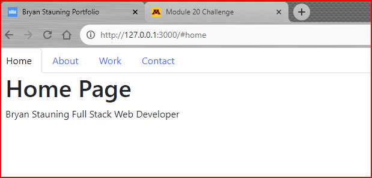
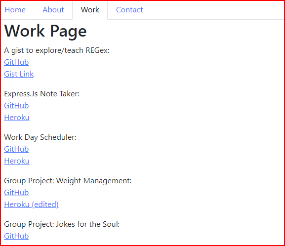
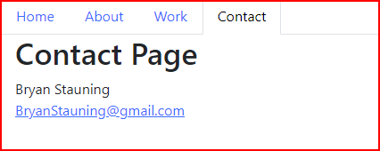

# React Work Sample Portfolio

Bootcamp 20.4 React Challenge:  

This is a student assignement to create and deploy a React Portfolio application that links to work created during the learning process.

## 🔗 The deliverable links (not to be confused with breakfast sausages):

[Github Link: https://github.com/MrBryanS/C20-React-WorkSamplePortfolio  ](https://github.com/MrBryanS/C20-React-WorkSamplePortfolio)

[Deployed link: 
]()

## 🚀 About Me
I'm a full stack developer: A developer in development
.

